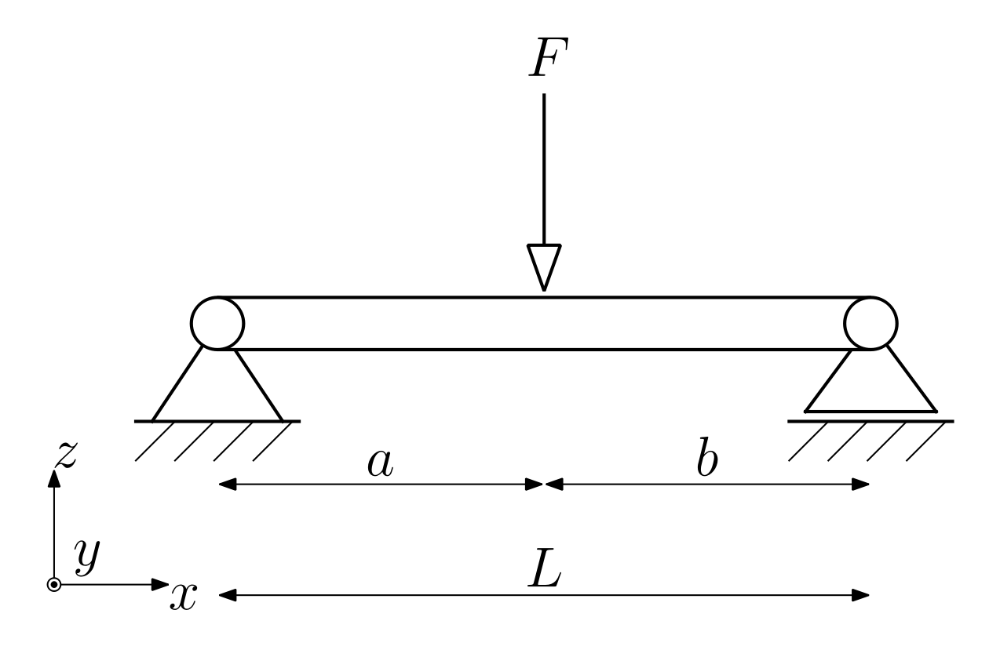
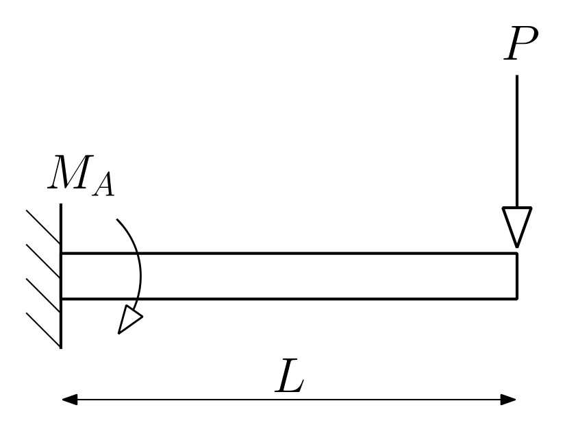
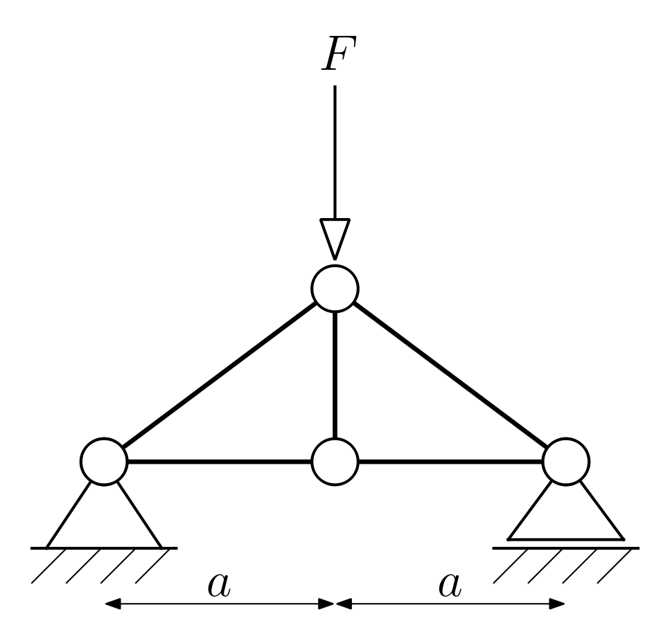
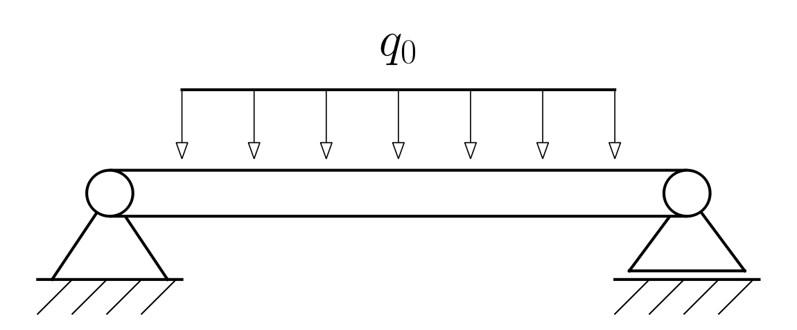
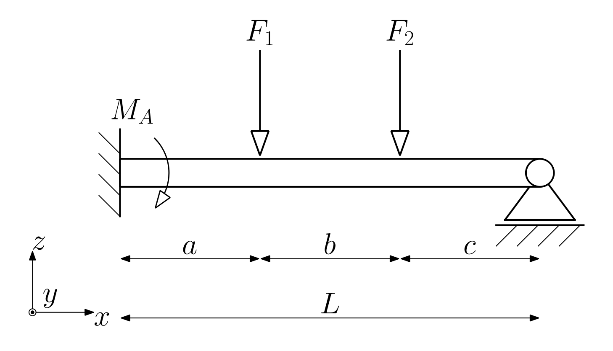
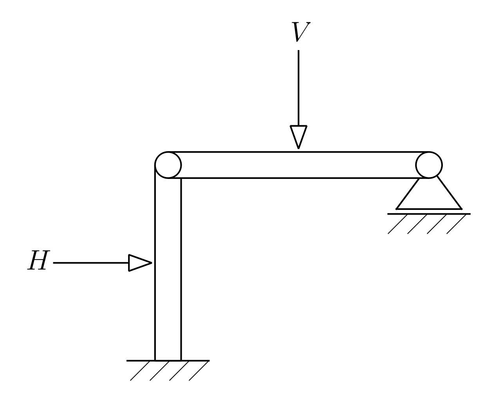
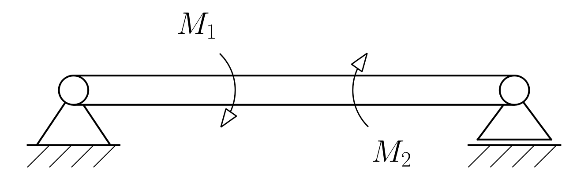
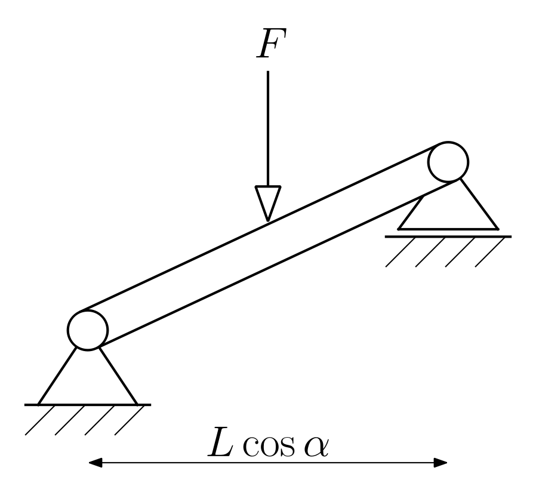
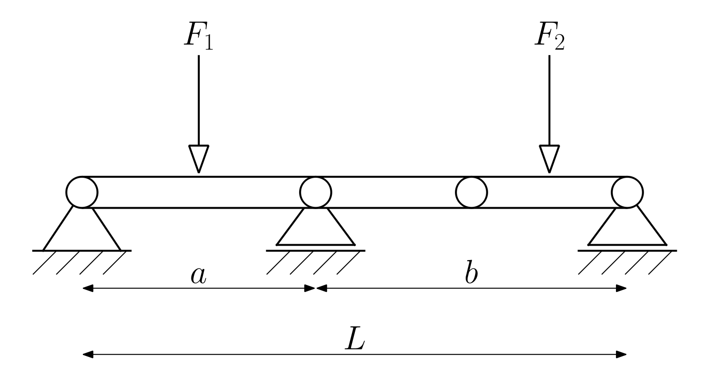
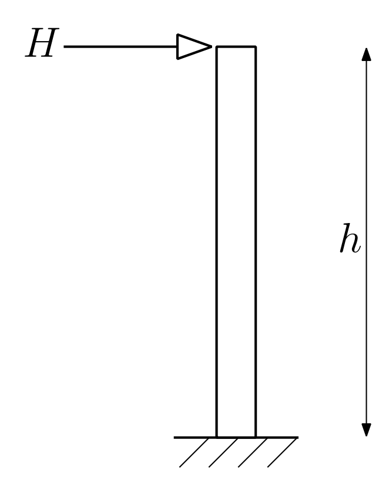

# MechanicsSketches

A Python library for creating and rendering technical sketches for engineering mechanics — beams, supports, forces, moments, dimensions, and more.

 

## Features

- **Programmatic API** — Build sketches from primitives (lines, circles, polygons, arcs, text) and pre-built mechanical components
- **Qt-based renderer** — High-quality PDF, PNG, and SVG output with automatic headless mode
- **Matplotlib fallback** — Alternative rendering via matplotlib with LaTeX support *(deprecated — text scaling issues)*
- **Graphical editor** — Interactive PyQt5 editor with drawing tools, component library, and property editing *(beta)*
- **Transformations** — Translate, rotate, and scale any primitive or group (non-destructive)
- **JSON serialization** — Save and load sketches as JSON files
- **OpenClaw AgentSkill** — Let AI agents generate sketches autonomously via the bundled [OpenClaw](https://openclaw.ai) skill

## Installation

```bash
pip install matplotlib PyQt5
```

For LaTeX text rendering, install a LaTeX distribution (e.g., TeX Live or MiKTeX).

## Quick Start

```python
from MechanicsSketches import *
import os

sketch = create_sketch("Simply Supported Beam")
S = 30.0  # Scale factor

# Beam
add_beam(sketch, ax=0, ay=0, bx=10*S, by=0, scale_factor=S)

# Supports
add_pinned_support(sketch, cx=0, cy=0, angle_deg=0, scale_factor=S)
add_roller_support(sketch, cx=10*S, cy=0, angle_deg=0, scale_factor=S)

# Force with LaTeX label
add_force(sketch, cx=5*S, cy=0, angle_deg=0, scale_factor=S, annotation=r"$F$")

# Render to PDF
script_dir = os.path.dirname(os.path.abspath(__file__))
render(sketch, filename=os.path.join(script_dir, "beam.pdf"), dpi=300)
```

## Examples

### Simply Supported Beam with Dimensions

```python
from MechanicsSketches import *
S = 30.0

sketch = create_sketch("Simply Supported Beam")
add_beam(sketch, ax=0, ay=0, bx=10*S, by=0, scale_factor=S)
add_pinned_support(sketch, cx=0, cy=0, angle_deg=0, scale_factor=S)
add_roller_support(sketch, cx=10*S, cy=0, angle_deg=0, scale_factor=S)
add_force(sketch, cx=5*S, cy=0, angle_deg=0, scale_factor=S, annotation=r"$F$")

add_dimension_arrow_pp(sketch, ax=0, ay=-2.8*S, bx=5*S, by=-2.8*S,
                       scale_factor=S*0.5, annotation=r"$a$", fontsize_scale=2.0)
add_dimension_arrow_pp(sketch, ax=5*S, ay=-2.8*S, bx=10*S, by=-2.8*S,
                       scale_factor=S*0.5, annotation=r"$b$", fontsize_scale=2.0)
add_dimension_arrow_pp(sketch, ax=0, ay=-4.5*S, bx=10*S, by=-4.5*S,
                       scale_factor=S*0.5, annotation=r"$L$", fontsize_scale=2.0)
add_coordinate_system(sketch, cx=-2.5*S, cy=-4*S, scale_factor=S*0.5,
                      ax1=r"$x$", ax2=r"$z$", ax3=r"$y$",
                      last_axis_out_of_image=True, fontsize_scale=2.0)

render(sketch, filename="beam.png", dpi=200)
```



### Cantilever with Moment

```python
sketch = create_sketch("Cantilever Beam")
add_fixed_support(sketch, cx=0, cy=0, angle_deg=0, scale_factor=S)
add_beam(sketch, ax=0, ay=0, bx=8*S, by=0, scale_factor=S)
add_force(sketch, cx=8*S, cy=0, angle_deg=0, scale_factor=S, annotation=r"$P$")
add_moment(sketch, cx=0, cy=0, angle_deg=0, scale_factor=S*0.7,
           annotation=r"$M_A$", fontsize_scale=1.4)
add_dimension_arrow_pp(sketch, ax=0, ay=-2.5*S, bx=8*S, by=-2.5*S,
                       scale_factor=S*0.5, annotation=r"$L$", fontsize_scale=2.0)
render(sketch, filename="cantilever.png", dpi=200)
```



### Truss Structure

```python
sketch = create_sketch("Simple Truss")
t = S * 0.08  # truss line thickness
add_truss(sketch, ax=0, ay=0, bx=4*S, by=0, scale_factor=t)
add_truss(sketch, ax=4*S, ay=0, bx=8*S, by=0, scale_factor=t)
add_truss(sketch, ax=0, ay=0, bx=4*S, by=3*S, scale_factor=t)
add_truss(sketch, ax=4*S, ay=3*S, bx=8*S, by=0, scale_factor=t)
add_truss(sketch, ax=4*S, ay=0, bx=4*S, by=3*S, scale_factor=t)
for cx, cy in [(0,0), (4*S,0), (8*S,0), (4*S,3*S)]:
    add_hinge(sketch, cx=cx, cy=cy, scale_factor=S)
add_pinned_support(sketch, cx=0, cy=0, angle_deg=0, scale_factor=S)
add_roller_support(sketch, cx=8*S, cy=0, angle_deg=0, scale_factor=S)
add_force(sketch, cx=4*S, cy=3*S, angle_deg=0, scale_factor=S, annotation=r"$F$")
render(sketch, filename="truss.png", dpi=200)
```



### Distributed Load

```python
sketch = create_sketch("Distributed Load")
Sf = S * 0.4  # smaller arrows for distributed load
beam_top = 0.4 * S

add_beam(sketch, ax=0, ay=0, bx=10*S, by=0, scale_factor=S)
add_pinned_support(sketch, cx=0, cy=0, angle_deg=0, scale_factor=S)
add_roller_support(sketch, cx=10*S, cy=0, angle_deg=0, scale_factor=S)

# Place arrows at beam top surface so arrowheads don't overlap the beam
for i in range(1, 8):
    add_force(sketch, cx=i*10*S/8, cy=beam_top, angle_deg=0, scale_factor=Sf)

# Connect arrow tops and label
arrow_top_y = beam_top + 3.5 * Sf
add_to_sketch(sketch, make_line(10*S/8, arrow_top_y, 7*10*S/8, arrow_top_y, 0.05*S, 8))
add_to_sketch(sketch, make_text(5*S, arrow_top_y + 0.8*S, r"$q_0$", fontsize=S, layer=10))
render(sketch, filename="distributed.png", dpi=200)
```



> **More examples** — See [`examples/best_practices.py`](examples/best_practices.py) for 10 fully documented templates including frames, inclined beams, two-span beams, and vertical columns.

## Visual Benchmarks

These reference images are generated by [`examples/best_practices.py`](examples/best_practices.py) and tested by [`tests/test_visual_benchmarks.py`](tests/test_visual_benchmarks.py). They serve as visual regression tests — any code change that breaks rendering or causes overlaps will be caught.

Regenerate with:

```bash
QT_QPA_PLATFORM=offscreen python examples/best_practices.py
```

Run the automated tests with:

```bash
QT_QPA_PLATFORM=offscreen python -m pytest tests/test_visual_benchmarks.py -v
```

| | | |
|:---:|:---:|:---:|
| **Simply Supported Beam** | **Cantilever with Moment** | **Propped Cantilever** |
|  |  |  |
| **Truss Structure** | **L-Frame** | **Distributed Load** |
|  |  |  |
| **Beam with Moments** | **Inclined Beam** | **Two-Span Beam** |
|  |  |  |
| **Vertical Column** | | |
|  | | |

## Available Components

| Component | Function | Description |
|-----------|----------|-------------|
| Pinned support | `add_pinned_support()` | Triangle with hatching (Festlager) |
| Roller support | `add_roller_support()` | Support with sliding gap (Loslager) |
| Fixed support | `add_fixed_support()` | Wall with hatching (Einspannung) |
| Hinge | `add_hinge()` | Joint circle (Gelenk) |
| Beam | `add_beam()` | Rectangular beam between two points |
| Truss | `add_truss()` | Line member between two points |
| Force | `add_force()` | Arrow with optional annotation |
| Moment | `add_moment()` | Curved arrow with optional annotation |
| Moment arrow | `add_moment_arrow()` | Straight arrow with double arrowhead (>>) |
| Dimension | `add_dimension_arrow()` | Double-headed measuring arrow |
| Thickness | `add_dimension_thickness()` | Inward-pointing dimension |
| Coord. system | `add_coordinate_system()` | x-y-z axis indicator |

Each component has a `make_*` variant that returns primitives without adding to a sketch.

## OpenClaw Integration

This library includes an [OpenClaw](https://openclaw.ai) AgentSkill, so AI agents can generate mechanics sketches autonomously. To install:

```bash
cp -r skills/mechanics-sketches ~/.openclaw/skills/
```

See [`skills/mechanics-sketches/SKILL.md`](skills/mechanics-sketches/SKILL.md) for details.

## Project Structure

```
MechanicsSketches/
├── __init__.py       # Package exports
├── base.py           # Primitives, transformations, sketch management
├── elements.py       # Pre-built mechanical components
├── qt_renderer.py    # Qt-based renderer (default)
├── renderer.py       # Matplotlib renderer (fallback)
├── editor.py         # PyQt5 graphical editor
├── docs.md           # Full API documentation
├── examples/
│   └── best_practices.py   # 10 golden template sketches
├── tests/
│   └── test_visual_benchmarks.py  # Automated rendering tests
└── skills/           # OpenClaw AgentSkill
    └── mechanics-sketches/
        ├── SKILL.md
        ├── scripts/generate_sketch.py
        └── references/api_reference.md
```

## Documentation

See [docs.md](docs.md) for the complete API reference, including all function signatures, parameters, orientation conventions, and additional examples.

## License

This project is licensed under the [MIT License](LICENSE).
